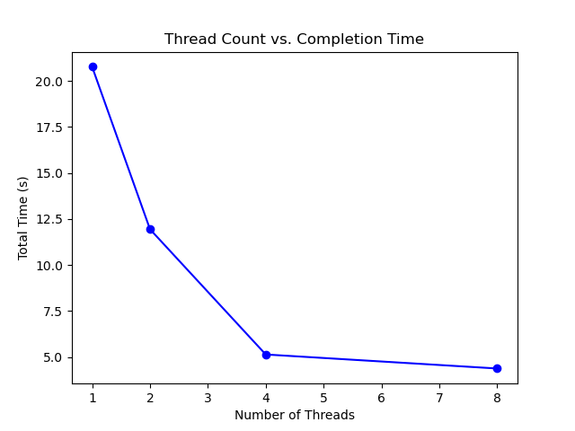

Timing and Optimization Report
Approach

Profiling: Measured total execution time using clock_gettime.
Testing: Ran the program with urls.txt for num_threads = 1, 2, 4, 8.

Results

Number of Threads               Total Time (s)

1                               20.768

2                               11.943

4                               5.139

8                               4.377

Analysis

Bottleneck: Downloading URLs is the main bottleneck due to network latency.
Thread Performance: More threads improve performance up to a point (e.g., 4 threads) by parallelizing downloads. Beyond that, gains lessen due to network limits and thread overhead.
Optimization: Increasing threads helps, but asynchronous I/O could further improve performance (not implemented here).

Graph

